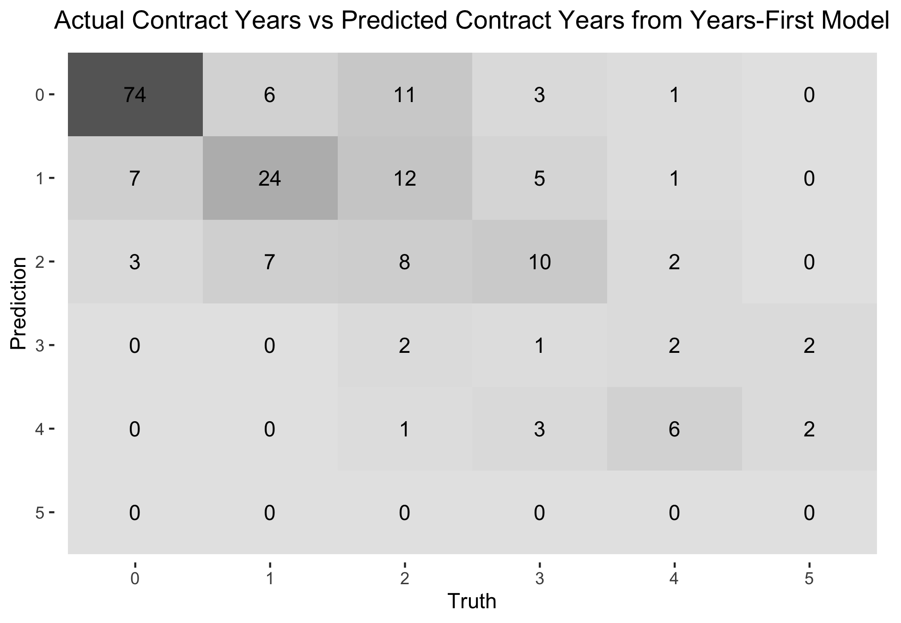
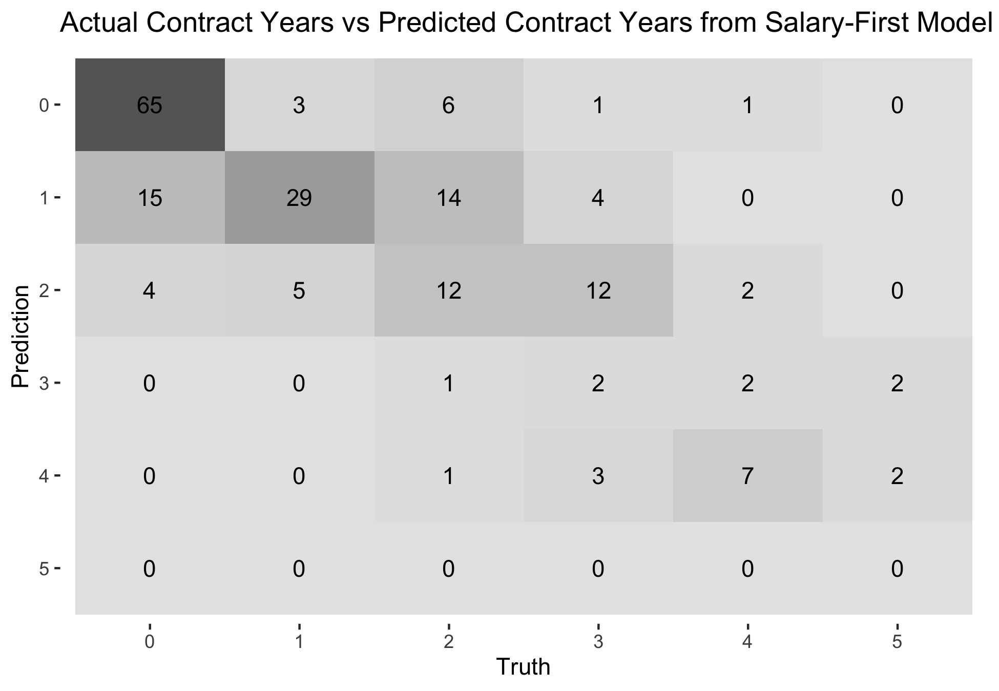

```{r setup, include=FALSE}
knitr::opts_chunk$set(cache=TRUE,
                      echo = TRUE,
                      warning = FALSE,
                      message = FALSE)
```

# Introduction

# Methods/Analysis

## Loading Packages

Let's start by loading required packages.
```{r load_pkgs, results="hide"}
if(!require(tidyverse)) 
  install.packages("tidyverse", repos = "http://cran.us.r-project.org")
if(!require(tidymodels)) 
  install.packages("tidymodels", repos = "http://cran.us.r-project.org")
#for cleaning variable names
if(!require(janitor)) 
  install.packages("janitor", repos = "http://cran.us.r-project.org")
#for multinomial regression
if(!require(glmnet)) 
  install.packages("glmnet", repos = "http://cran.us.r-project.org")
#ranger is random forest algorithm wrapper
if(!require(ranger)) 
  install.packages("ranger", repos = "http://cran.us.r-project.org")
#kernlab is svm kernel wrapper
if(!require(kernlab)) 
  install.packages("kernlab", repos = "http://cran.us.r-project.org")
#for variable importance
if(!require(vip)) 
  install.packages("vip", repos = "http://cran.us.r-project.org")
#zoo allows rolling operations
if(!require(zoo))
  install.packages("zoo", repos = "http://cran.us.r-project.org")
#matrix stats
if(!require(matrixStats)) 
  install.packages("matrixStats", repos = "http://cran.us.r-project.org")
#rpart.plot shows the decision tree of an rpart result
if(!require(rpart.plot)) 
  install.packages("rpart.plot", repos = "http://cran.us.r-project.org")
#kableExtra allows more customization of tables
if(!require(kableExtra)) 
  install.packages("kableExtra")
if(!require(RColorBrewer)) 
  install.packages("RColorBrewer", repos = "http://cran.us.r-project.org")
#for dark background plots
if(!require(ggdark)) 
  install.packages("ggdark", repos = "http://cran.us.r-project.org")
#easy formatting of numbers as currency & percent
if(!require(formattable)) 
  install.packages("ggdark", repos = "http://cran.us.r-project.org")

```

## Importing the Data

For the statistical data, I've scraped total and advanced stats from Basketball-Reference and stored them in .csv files. This was actually part of a larger project to scrape complete statistics for teams, players and awards (the Kaggle dataset resides [here](https://www.kaggle.com/sumitrodatta/nba-aba-baa-stats)). To my knowledge, my dataset is unique in that it includes BAA stats and ABA stats, which is not really of use here. 

The advanced stats I kept were cumulative (offensive win shares, defensive win shares and value over replacement player). For players who played on multiple teams in one season, I kept their total stats and discarded the team-specific season portions. There was an initial desire to use totals to bake in availability/body fragility, but the shortened seasons would cause the model to declare all players to be fragile and underestimate their contract.

In the previous iteration of this project, we scaled games played and games started to a normal distribution due to fluctuations in games played between seasons caused by the COVID-19 pandemic. We will convert the games started to a percentage of games played and we will change the games played to a percentage of maximum playable games. This maximum will differ for players who played for multiple teams in one season.
```{r load_stats}
#specify columns because otherwise birth year is read as logical
cols_for_stats=cols(
  .default = col_double(),
  player = col_character(),
  hof = col_logical(),
  pos = col_character(),
  lg = col_character(),
  tm = col_character()
)

advanced<-read_csv("Data/Advanced.csv",col_types = cols_for_stats) %>%
  select(seas_id:mp,ows:ws,vorp)
totals<-read_csv("Data/Player Totals.csv",col_types = cols_for_stats)
#max games per season for players on multiple teams
max_games_tots=totals %>% filter(tm=="TOT") %>% group_by(season,lg,tm) %>%
  summarize(max_games_tot=max(g,na.rm = TRUE)) %>% ungroup()
#max games per season for players on single team
max_games=totals %>% filter(tm !="TOT") %>% group_by(season,lg) %>%
  summarize(max_games_non_tot=max(g,na.rm = TRUE)) %>% ungroup()
#coalesce above two into one column in totals df
totals_enhanced=left_join(totals,max_games_tots) %>% left_join(.,max_games) %>%
  mutate(max_games_playable=coalesce(max_games_tot,max_games_non_tot)) %>% 
  select(-c(max_games_non_tot,max_games_tot))
advanced_and_totals<-left_join(totals_enhanced,advanced) %>%
  #if player played for multiple teams in season, only take total row
  mutate(tm=ifelse(tm=="TOT","1TOT",tm)) %>% 
  group_by(player_id,season) %>% arrange(tm) %>% slice(1) %>% 
  mutate(tm=ifelse(tm=="1TOT","TOT",tm)) %>% 
  arrange(season,player) %>%
  mutate(g_percent=g/max_games_playable*100,gs_percent=gs/g*100,.before=g) %>% 
  select(-c(gs,max_games_playable)) %>% 
  #filter for only last ten years for faster pre-processing
  filter(season > 2009) %>% ungroup()
```

A comment was raised last year regarding positional scarcity. Teams will overpay for the potential piece that puts them "over the hump", whether that be into playoff contention or the more loftier goal of championship contention. Teams might also panic to acquire a player that is deemed to be the last one in a talent tier above the remaining free agents in the same position. 

The play-by-play data (available since the 1997 season) keeps track of the percentage of minutes played a player has played in each traditional position (point guard, shooting guard, small forward, power forward & center). I converted the percentages to raw minutes played at each position, and summed across all teams a player played for in the same season. I felt this method was more accurate than using the "totals" row.
```{r load_pbp}
play_by_play<-read_csv("Data/Player Play By Play.csv") %>% 
  filter(tm!="TOT") %>%
  select(seas_id:player,mp:c_percent)

#replace NA's with zeroes
play_by_play[is.na(play_by_play)] <- 0

pbp_pos_mins=play_by_play %>% 
  #convert percents to minutes played at position
  mutate(across(pg_percent:c_percent,~./100*mp)) %>% 
  rename_with(.fn=~gsub(x = ., pattern = "_percent", replacement = "_mp"),
              .cols=pg_percent:c_percent) %>%
  #sum season minutes across different teams
  group_by(season,player_id) %>% 
  mutate(across(mp:c_mp,sum,.names="{col}_summed")) %>% 
  slice(1) %>% ungroup() %>% select(-c(mp:c_mp))

```

```{r clean_environ,include=FALSE}
rm(cols_for_stats,advanced,totals,max_games_tots,max_games,totals_enhanced,
   play_by_play)
```

I've updated the free agents training set from last year to include the 2021 free agents. As a quick refresh:

* scrape the Basketball-Reference [free agents tracker](https://www.basketball-reference.com/friv/free_agents.fcgi)
* removed retired players and players who signed from overseas (wouldn't have any contract year data) from the dataset
* set contract years to zero and salary to zero for players who:
    + went overseas (not many, considering the pandemic)
    + had explicitly non guaranteed first years in their contracts (training camp deals, two ways, ten days, exhibit 10s)
    + had blanks in their contract terms cell
* included option years and partially guaranteed years in my calculation of contract years
    + looked at it as both sides (player and team) intending to see out the contract
* gathered year 1 salary for remaining players using [Spotrac](https://www.spotrac.com/nba/contracts/)
    + I'd previously used Capology, Basketball-Reference & Basketball-Insiders, but they were not needed since I got started with the data-gathering before/during the season rather than after the season
* general housekeeping like adding suffixes (Jr., II, III) to certain players to match up with statistical data
```{r load_train}
past_free_agents<-read_csv("Data/2016-2021 Free Agents.csv")
```
The next file I used was salary cap history, scraped from RealGM. To somewhat normalize comparisons across years, I converted the first year salary to a percentage of the salary cap.

```{r load_cap_hist}
#subtract one from year to match up with offseason in which contract was signed
salary_cap_hist<-read_csv("Data/Salary Cap History.csv") %>% mutate(season=season-1)
#create variable of first year salary as percentage of cap
#easier to compare across years
past_free_agents<-past_free_agents %>% select(-c(terms,Source)) %>% 
  left_join(.,salary_cap_hist) %>% 
  mutate(first_year_percent_of_cap=yr_1_salary/cap) %>% 
  select(-c(yr_1_salary,cap))
```

The last file loaded is our evaluation set: the 2022 free agent class, retrieved from Spotrac.I had to edit this dataset to match the Basketball-Reference names (mainly adding diacritics to European names). In addition, I filtered out players with options. Players who decline player options and players who have their team options declined with more than 3 years of experience become unrestricted free agents. Players with less than or equal to 3 years of experience and a declined team option become restricted free agents. I'll use this fact to see which players & teams might decline their option.

```{r load_eval}
current_fa<-read_csv("Data/Free Agents 2022.csv")
#separate out options to compare what players options get if declined
current_fa_options<-current_fa %>% filter(str_detect(type,"PO|CO")) %>% 
  select(-c(experience,contract_yrs)) %>% 
  rename(option_type=type,option_amt=first_year_percent_of_cap) %>%
  mutate(option_amt=currency(option_amt,digits=0))
#make player options all declined (UFA's)
#make club options ufa or rfa depending on exp
current_fa<-current_fa %>%
  mutate(type=case_when((type=="PO"|(type=="CO" & experience >= 4))~"UFA",
                        (type=="CO" & experience < 4)~"RFA",
                        TRUE~type)) %>% 
  group_by(player) %>% select(-experience) %>% slice(1) %>% ungroup() %>% 
  mutate(first_year_percent_of_cap=NA)
```

In the GitHub repository where this project is located, a file called `free agents.r` has more details on exactly how I scraped the train set, evaluation set and the salary cap history.

## Retrospective on Last Year's Results

Before getting into pre-processing, we'll take a look at last year's results and see how the models performed. We remove players who ended up not hitting the market due to their option being picked up. Any player who was predicted but didn't end up in the free agent history must not have received a contract, so their NA's were replaced with zeroes.

```{r last_years_results_load, echo=FALSE}
non_options=read_csv("https://raw.githubusercontent.com/sumitrodatta/contract-prediction-2021/master/Non-Option%20Contracts.csv")
options=read_csv("https://raw.githubusercontent.com/sumitrodatta/contract-prediction-2021/master/Options.csv")
combined_predictions=bind_rows(non_options,options) %>% 
  clean_names() %>% 
  #take out totals
  select(-starts_with("total")) %>%
  select(-c(age,type)) %>% 
  mutate(across(ends_with("cap_percent"),~parse_number(.)/100)) %>%
  mutate(x2021_option=parse_number(x2021_option)) %>%
  #join predictions with actual
  left_join(.,past_free_agents %>% filter(season==2021)) %>%
  select(-c(season,ws,option_type,type)) %>% 
  #filter out players who either picked up player option or had team option picked up
  filter(is.na(x2021_option)|!is.na(contract_yrs)) %>%
  select(-x2021_option) %>%
  replace_na(list(contract_yrs=0,first_year_percent_of_cap=0)) %>%
  mutate(contract_yrs=factor(contract_yrs,levels=0:5),
         yrs_y1s2=factor(yrs_y1s2,levels=0:5),
         yrs_s1y2=factor(yrs_s1y2,levels=0:5)) %>%
  mutate(across(contains("cap"),~round(.,digits=4)))
rm(non_options,options)
```

```{r accuracy,echo=FALSE}
y1s2_yr_acc=round(accuracy(combined_predictions,truth=contract_yrs,estimate=yrs_y1s2) %>% pull(.estimate)*100,2)
s1y2_yr_acc=round(accuracy(combined_predictions,truth=contract_yrs,estimate=yrs_s1y2) %>% pull(.estimate)*100,2)
```

The years accuracy of the years-first model was `r y1s2_yr_acc`%, while the years accuracy of the salary-first model was `r s1y2_yr_acc`%. The 2020 models were at 49-51% accuracy, so there's been a significant improvement. Here's some confusion matrices on how each model handled the prediction of contract years.

```{r years_confusion_matrix,fig.show='hold',out.width="50%",echo=FALSE}
y1_yr_heatmap=combined_predictions %>%
  conf_mat(data=.,truth=contract_yrs,estimate=yrs_y1s2) %>%
  autoplot(type="heatmap") +
  ggtitle("Actual Contract Years vs Predicted Contract Years from Years-First Model")
ggsave(filename = "Images/Years Predict v Actual, Y1S2 Model.png",plot=y1_yr_heatmap)
s1_yr_heatmap=combined_predictions %>%
  conf_mat(data=.,truth=contract_yrs,estimate=yrs_s1y2) %>%
  autoplot(type="heatmap") +
  ggtitle("Actual Contract Years vs Predicted Contract Years from Salary-First Model")
ggsave(filename = "Images/Years Predict v Actual, S1Y2 Model.png",plot=s1_yr_heatmap)


```
The incorrect predictions were pessimistic, in that they skewed toward predicting less years than received as evidenced by the sum of the upper triangle being greater than the lower triangle (models forecasting no contract for players who received a one-year contract, one year for players who got two years, etc).

Here are the worst misses for both models.

```{r last_yr_extreme_yr_misses,echo=FALSE,results='asis'}
yrs_s1y2_misses=combined_predictions %>% 
                        arrange(desc(contract_yrs),desc(yrs_s1y2)) %>%
  mutate(abs_error_y1s2_yrs=abs(as.numeric(contract_yrs)-as.numeric(yrs_y1s2))) %>% 
  slice_max(abs_error_y1s2_yrs,n=5) %>% select(player,yrs_y1s2,contract_yrs)
yrs_y1s2_misses=combined_predictions %>% 
                        arrange(desc(contract_yrs),desc(yrs_y1s2)) %>%
  mutate(abs_error_s1y2_yrs=abs(as.numeric(contract_yrs)-as.numeric(yrs_s1y2))) %>% 
  slice_max(abs_error_s1y2_yrs,n=5) %>% select(player,yrs_s1y2,contract_yrs)
knitr::kable(yrs_s1y2_misses)
knitr::kable(yrs_y1s2_misses)
```


```{r last_yr_results,echo=FALSE}
y1_rmse=rmse(combined_predictions,
             truth=first_year_percent_of_cap,
             estimate=y1s2_cap_percent) %>% 
  pull(.estimate)
s1_rmse=rmse(combined_predictions,
             truth=first_year_percent_of_cap,
             estimate=s1y2_cap_percent) %>%
  pull(.estimate)
```

Let's shift our focus to the salary predictions. First, the residual mean squared error of the years-first model was `r y1_rmse`, while the salary-first model had an RMSE of `r s1_rmse`.

As we did with the years models, let's look at the most extreme salary misses.

```{r last_yr_extreme_sal_misses,echo=FALSE}
sal_y1s2_misses=combined_predictions %>% 
  mutate(abs_error_y1s2_salary=abs(first_year_percent_of_cap - y1s2_cap_percent)) %>% 
  slice_max(abs_error_y1s2_salary,n=10) %>%
  mutate(first_year_percent_of_cap=
           formattable::percent(first_year_percent_of_cap,digits=2),
         y1s2_cap_percent=
           formattable::percent(y1s2_cap_percent,digits=2)) %>%
  select(player,y1s2_cap_percent,first_year_percent_of_cap)
sal_s1y2_misses=combined_predictions %>% 
  mutate(abs_error_s1y2_salary=abs(first_year_percent_of_cap - s1y2_cap_percent)) %>% 
  slice_max(abs_error_s1y2_salary,n=10) %>% 
  mutate(first_year_percent_of_cap=
           formattable::percent(first_year_percent_of_cap,digits=2),
         s1y2_cap_percent=
           formattable::percent(s1y2_cap_percent,digits=2)) %>%
  select(player,s1y2_cap_percent,first_year_percent_of_cap)
knitr::kable(sal_y1s2_misses)
knitr::kable(sal_s1y2_misses)
```
Schröder miscalculated his market, rejecting a 4-year & $84 million contract extension during the season from the Lakers and ended up settling for a one-year, prove-it contract for the mid-level exception from the Boston Celtics.

On a more positive note, here's some players on which the models were very close on. We'll restrict our view to contracts that had a first year salary that was greater than 5% of the salary cap, as it's easier to get close to minimum & near-minimum contract amounts.

```{r last_yr_extreme_sal_close,echo=FALSE}
sal_y1s2_close=combined_predictions %>% 
  filter(contract_yrs %in% c(1:5) & 
           yrs_y1s2 %in% c(1:5) & 
           first_year_percent_of_cap > 0.05) %>%
  mutate(abs_error_y1s2_salary=abs(first_year_percent_of_cap - y1s2_cap_percent)) %>% 
  slice_min(abs_error_y1s2_salary,n=10) %>%
  mutate(first_year_percent_of_cap=
           formattable::percent(first_year_percent_of_cap,digits=2),
         y1s2_cap_percent=
           formattable::percent(y1s2_cap_percent,digits=2)) %>%
  select(player,y1s2_cap_percent,first_year_percent_of_cap)
sal_s1y2_close=combined_predictions %>% 
  filter(contract_yrs %in% c(1:5) & 
           yrs_y1s2 %in% c(1:5) &
           first_year_percent_of_cap > 0.05) %>%
  mutate(abs_error_s1y2_salary=abs(first_year_percent_of_cap - s1y2_cap_percent)) %>% 
  slice_min(abs_error_s1y2_salary,n=10) %>%
  mutate(first_year_percent_of_cap=
           formattable::percent(first_year_percent_of_cap,digits=2),
         s1y2_cap_percent=
           formattable::percent(s1y2_cap_percent,digits=2)) %>%
  select(player,s1y2_cap_percent,first_year_percent_of_cap)
knitr::kable(sal_y1s2_close)
knitr::kable(sal_s1y2_close)
```

```{r remove_retrospective_vars,include=FALSE}
rm(y1_rmse,s1_rmse,y1_yr_heatmap,s1_yr_heatmap,s1y2_yr_acc,y1s2_yr_acc,combined_predictions,
   sal_s1y2_close,sal_s1y2_misses,sal_y1s2_close,sal_y1s2_misses,yrs_s1y2_misses,yrs_y1s2_misses)
```

