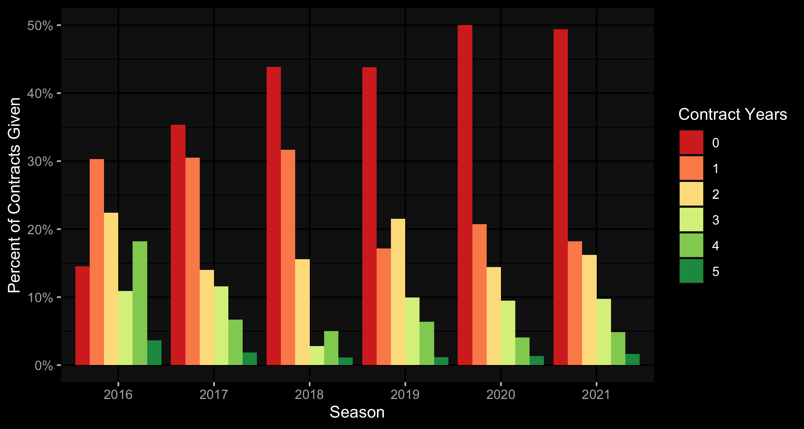

```{r setup, include=FALSE}
knitr::opts_chunk$set(cache=TRUE,
                      echo = TRUE,
                      warning = FALSE,
                      message = FALSE)
```

# Introduction

# Methods/Analysis

## Loading Packages

Let's start by loading required packages.
```{r load_pkgs, results="hide"}
if(!require(tidyverse)) 
  install.packages("tidyverse", repos = "http://cran.us.r-project.org")
if(!require(tidymodels)) 
  install.packages("tidymodels", repos = "http://cran.us.r-project.org")
#for cleaning variable names
if(!require(janitor)) 
  install.packages("janitor", repos = "http://cran.us.r-project.org")
#for multinomial regression
if(!require(glmnet)) 
  install.packages("glmnet", repos = "http://cran.us.r-project.org")
#ranger is random forest algorithm wrapper
if(!require(ranger)) 
  install.packages("ranger", repos = "http://cran.us.r-project.org")
#kknn is nearest neighbors algorithm wrapper
if(!require(kknn)) 
  install.packages("kknn", repos = "http://cran.us.r-project.org")
#kernlab is svm kernel wrapper
if(!require(kernlab)) 
  install.packages("kernlab", repos = "http://cran.us.r-project.org")
#for variable importance
if(!require(vip)) 
  install.packages("vip", repos = "http://cran.us.r-project.org")
#zoo allows rolling operations
if(!require(zoo))
  install.packages("zoo", repos = "http://cran.us.r-project.org")
#matrix stats
if(!require(matrixStats)) 
  install.packages("matrixStats", repos = "http://cran.us.r-project.org")
#rpart.plot shows the decision tree of an rpart result
if(!require(rpart.plot)) 
  install.packages("rpart.plot", repos = "http://cran.us.r-project.org")
#kableExtra allows more customization of tables
if(!require(kableExtra)) 
  install.packages("kableExtra", repos = "http://cran.us.r-project.org")
if(!require(RColorBrewer)) 
  install.packages("RColorBrewer", repos = "http://cran.us.r-project.org")
#for dark background plots
if(!require(ggdark)) 
  install.packages("ggdark", repos = "http://cran.us.r-project.org")
#easy formatting of numbers as currency & percent
if(!require(formattable)) 
  install.packages("ggdark", repos = "http://cran.us.r-project.org")
#for timing runs
if(!require(tictoc)) 
  install.packages("tictoc", repos = "http://cran.us.r-project.org")

```

## Importing the Data

For the statistical data, I've scraped total and advanced stats from Basketball-Reference and stored them in .csv files. This was actually part of a larger project to scrape complete statistics for teams, players and awards (the Kaggle dataset resides [here](https://www.kaggle.com/sumitrodatta/nba-aba-baa-stats)). To my knowledge, my dataset is unique in that it includes BAA stats and ABA stats, which is not really of use here. 

The advanced stats I kept were cumulative (offensive win shares, defensive win shares and value over replacement player). For players who played on multiple teams in one season, I kept their total stats and discarded the team-specific season portions. There was an initial desire to use totals to bake in availability/body fragility, but the shortened seasons would cause the model to declare all players to be fragile and underestimate their contract.

In the previous iteration of this project, we scaled games played and games started to a normal distribution due to fluctuations in games played between seasons caused by the COVID-19 pandemic. We will convert the games started to a percentage of games played and we will change the games played to a percentage of maximum playable games. This maximum will differ for players who played for multiple teams in one season.
```{r load_stats}
#specify columns because otherwise birth year is read as logical
cols_for_stats=cols(
  .default = col_double(),
  player = col_character(),
  pos = col_character(),
  lg = col_character(),
  tm = col_character()
)

advanced<-read_csv("Data/Advanced.csv",col_types = cols_for_stats) %>%
  select(seas_id:mp,ows:ws,vorp) %>% mutate(ws_per_48=ws/mp*48,.before="vorp")
totals<-read_csv("Data/Player Totals.csv",col_types = cols_for_stats)
#max games per season for players on multiple teams
max_games_tots=totals %>% filter(tm=="TOT") %>% group_by(season,lg,tm) %>%
  summarize(max_games_tot=max(g,na.rm = TRUE)) %>% ungroup()
#max games per season for players on single team
max_games=totals %>% filter(tm !="TOT") %>% group_by(season,lg) %>%
  summarize(max_games_non_tot=max(g,na.rm = TRUE)) %>% ungroup()
#coalesce above two into one column in totals df
totals_enhanced=left_join(totals,max_games_tots) %>% left_join(.,max_games) %>%
  mutate(max_games_playable=coalesce(max_games_tot,max_games_non_tot)) %>% 
  select(-c(max_games_non_tot,max_games_tot))
advanced_and_totals<-left_join(totals_enhanced,advanced) %>%
  #if player played for multiple teams in season, only take total row
  mutate(tm=ifelse(tm=="TOT","1TOT",tm)) %>% 
  group_by(player_id,season) %>% arrange(tm) %>% slice(1) %>% 
  mutate(tm=ifelse(tm=="1TOT","TOT",tm)) %>% 
  arrange(season,player) %>%
  mutate(g_percent=g/max_games_playable,gs_percent=gs/g,.before=g) %>% 
  select(-c(gs,max_games_playable)) %>% 
  #filter for only last ten years for faster pre-processing
  filter(season > 2009) %>% ungroup()
```

A comment was raised last year regarding positional scarcity. Teams will overpay for the potential piece that puts them "over the hump", whether that be into playoff contention or the more loftier goal of championship contention. Teams might also panic to acquire a player that is deemed to be the last one in a talent tier above the remaining free agents in the same position. 

The play-by-play data (available since the 1997 season) keeps track of the percentage of minutes played a player has played in each traditional position (point guard, shooting guard, small forward, power forward & center). I converted the percentages to raw minutes played at each position, and summed across all teams a player played for in the same season. I felt this method was more accurate than using the "totals" row.
```{r load_pbp}
play_by_play<-read_csv("Data/Player Play By Play.csv") %>% 
  filter(tm!="TOT") %>%
  select(seas_id:player,mp:c_percent)

#replace NA's with zeroes
play_by_play[is.na(play_by_play)] <- 0

pbp_pos_mins=play_by_play %>% 
  #convert percents to minutes played at position
  mutate(across(pg_percent:c_percent,~./100*mp)) %>% 
  rename_with(.fn=~gsub(x = ., pattern = "_percent", replacement = "_mp"),
              .cols=pg_percent:c_percent) %>%
  #sum season minutes across different teams
  group_by(season,player_id) %>% 
  mutate(across(mp:c_mp,sum,.names="{col}_summed")) %>% 
  slice(1) %>% ungroup() %>% select(-c(mp:c_mp))

```

```{r clean_environ,include=FALSE}
rm(cols_for_stats,advanced,totals,max_games_tots,max_games,totals_enhanced,
   play_by_play)
```

I've updated the free agents training set from last year to include the 2021 free agents. As a quick refresh:

* scrape the Basketball-Reference [free agents tracker](https://www.basketball-reference.com/friv/free_agents.fcgi)
* removed retired players and players who signed from overseas (wouldn't have any contract year data) from the dataset
* set contract years to zero and salary to zero for players who:
    + went overseas (not many, considering the pandemic)
    + had explicitly non guaranteed first years in their contracts (training camp deals, two ways, ten days, exhibit 10s)
    + had blanks in their contract terms cell
* included option years and partially guaranteed years in my calculation of contract years
    + looked at it as both sides (player and team) intending to see out the contract
* gathered year 1 salary for remaining players using [Spotrac](https://www.spotrac.com/nba/contracts/)
    + I'd previously used Capology, Basketball-Reference & Basketball-Insiders, but they were not needed since I got started with the data-gathering before/during the season rather than after the season
* general housekeeping like adding suffixes (Jr., II, III) to certain players to match up with statistical data
```{r load_train}
past_free_agents<-read_csv("Data/2016-2021 Free Agents.csv")
```
The next file I used was salary cap history, scraped from RealGM. To somewhat normalize comparisons across years, I converted the first year salary to a percentage of the salary cap.

```{r load_cap_hist}
#subtract one from year to match up with offseason in which contract was signed
salary_cap_hist<-read_csv("Data/Salary Cap History.csv") %>% mutate(season=season-1)
#create variable of first year salary as percentage of cap
#easier to compare across years
past_free_agents<-past_free_agents %>% select(-c(terms,Source)) %>% 
  left_join(.,salary_cap_hist) %>% 
  mutate(first_year_percent_of_cap=yr_1_salary/cap) %>% 
  select(-c(yr_1_salary,cap))
```

The last file loaded is our evaluation set: the 2022 free agent class, retrieved from Spotrac. I had to edit this dataset to match the Basketball-Reference names (mainly adding diacritics to European names). In addition, I filtered out players with options. Players who decline player options and players who have their team options declined with more than 3 years of experience become unrestricted free agents. Players with less than or equal to 3 years of experience and a declined team option become restricted free agents. I'll use this fact to see which players & teams might decline their option.

```{r load_eval}
current_fa<-read_csv("Data/Free Agents 2022.csv")
#separate out options to compare what players options get if declined
current_fa_options<-current_fa %>% filter(str_detect(type,"PO|CO")) %>% 
  select(-c(experience,contract_yrs)) %>% 
  rename(option_type=type,option_amt=first_year_percent_of_cap) %>%
  mutate(option_amt=currency(option_amt,digits=0))
#make player options all declined (UFA's)
#make club options ufa or rfa depending on exp
current_fa<-current_fa %>%
  mutate(type=case_when((type=="PO"|(type=="CO" & experience >= 4))~"UFA",
                        (type=="CO" & experience < 4)~"RFA",
                        TRUE~type)) %>% 
  group_by(player) %>% select(-experience) %>% slice(1) %>% ungroup() %>% 
  mutate(first_year_percent_of_cap=NA)
```

In the GitHub repository where this project is located, a file called `free agents.r` has more details on exactly how I scraped the train set, evaluation set and the salary cap history.

## Retrospective on Last Year's Results

Before getting into pre-processing, we'll take a look at last year's results and see how the models performed. We remove players who ended up not hitting the market due to their option being picked up. Any player who was predicted but didn't end up in the free agent history must not have received a contract, so their NA's were replaced with zeroes.

```{r last_years_results_load, echo=FALSE}
non_options=read_csv("https://raw.githubusercontent.com/sumitrodatta/contract-prediction-2021/master/Non-Option%20Contracts.csv")
options=read_csv("https://raw.githubusercontent.com/sumitrodatta/contract-prediction-2021/master/Options.csv")
combined_predictions=bind_rows(non_options,options) %>% 
  clean_names() %>% 
  #take out totals
  select(-starts_with("total")) %>%
  select(-c(age,type)) %>% 
  mutate(across(ends_with("cap_percent"),~parse_number(.)/100)) %>%
  mutate(x2021_option=parse_number(x2021_option)) %>%
  #join predictions with actual
  left_join(.,past_free_agents %>% filter(season==2021)) %>%
  select(-c(season,ws,option_type,type)) %>% 
  #filter out players who either picked up player option or had team option picked up
  filter(is.na(x2021_option)|!is.na(contract_yrs)) %>%
  select(-x2021_option) %>%
  replace_na(list(contract_yrs=0,first_year_percent_of_cap=0)) %>%
  mutate(contract_yrs=factor(contract_yrs,levels=0:5),
         yrs_y1s2=factor(yrs_y1s2,levels=0:5),
         yrs_s1y2=factor(yrs_s1y2,levels=0:5)) %>%
  mutate(across(contains("cap"),~round(.,digits=4)))
rm(non_options,options)
```

```{r accuracy,echo=FALSE}
y1s2_yr_acc=round(accuracy(combined_predictions,truth=contract_yrs,estimate=yrs_y1s2) %>% pull(.estimate)*100,2)
s1y2_yr_acc=round(accuracy(combined_predictions,truth=contract_yrs,estimate=yrs_s1y2) %>% pull(.estimate)*100,2)
```

The years accuracy of the years-first model was `r y1s2_yr_acc`%, while the years accuracy of the salary-first model was `r s1y2_yr_acc`%. The 2020 models were at 49-51% accuracy, so there's been a significant improvement. Here's some confusion matrices on how each model handled the prediction of contract years.

```{r years_confusion_matrix,fig.show='hold',out.width="50%",echo=FALSE}
y1_yr_heatmap=combined_predictions %>%
  conf_mat(data=.,truth=contract_yrs,estimate=yrs_y1s2) %>%
  autoplot(type="heatmap") +
  ggtitle("Actual Contract Years vs Predicted Contract Years from Years-First Model")
ggsave(filename = "Images/Years Predict v Actual, Y1S2 Model.png",plot=y1_yr_heatmap)
s1_yr_heatmap=combined_predictions %>%
  conf_mat(data=.,truth=contract_yrs,estimate=yrs_s1y2) %>%
  autoplot(type="heatmap") +
  ggtitle("Actual Contract Years vs Predicted Contract Years from Salary-First Model")
ggsave(filename = "Images/Years Predict v Actual, S1Y2 Model.png",plot=s1_yr_heatmap)

knitr::include_graphics("Images/Years Predict v Actual, S1Y2 Model.png")
```
The incorrect predictions were pessimistic, in that they skewed toward predicting less years than received as evidenced by the sum of the upper triangle being greater than the lower triangle (models forecasting no contract for players who received a one-year contract, one year for players who got two years, etc).

Here are the worst misses for both models.

```{r last_yr_extreme_yr_misses,echo=FALSE,results='asis'}
yrs_s1y2_misses=combined_predictions %>% 
                        arrange(desc(contract_yrs),desc(yrs_s1y2)) %>%
  mutate(abs_error_y1s2_yrs=abs(as.numeric(contract_yrs)-as.numeric(yrs_y1s2))) %>% 
  slice_max(abs_error_y1s2_yrs,n=5) %>% select(player,yrs_y1s2,contract_yrs)
yrs_y1s2_misses=combined_predictions %>% 
                        arrange(desc(contract_yrs),desc(yrs_y1s2)) %>%
  mutate(abs_error_s1y2_yrs=abs(as.numeric(contract_yrs)-as.numeric(yrs_s1y2))) %>% 
  slice_max(abs_error_s1y2_yrs,n=5) %>% select(player,yrs_s1y2,contract_yrs)
knitr::kable(yrs_s1y2_misses)
knitr::kable(yrs_y1s2_misses)
```


```{r last_yr_results,echo=FALSE}
y1_rmse=rmse(combined_predictions,
             truth=first_year_percent_of_cap,
             estimate=y1s2_cap_percent) %>% 
  pull(.estimate)
s1_rmse=rmse(combined_predictions,
             truth=first_year_percent_of_cap,
             estimate=s1y2_cap_percent) %>%
  pull(.estimate)
```

Let's shift our focus to the salary predictions. First, the residual mean squared error of the years-first model was `r y1_rmse`, while the salary-first model had an RMSE of `r s1_rmse`.

As we did with the years models, let's look at the most extreme salary misses.

```{r last_yr_extreme_sal_misses,echo=FALSE}
sal_y1s2_misses=combined_predictions %>% 
  mutate(abs_error_y1s2_salary=abs(first_year_percent_of_cap - y1s2_cap_percent)) %>% 
  slice_max(abs_error_y1s2_salary,n=10) %>%
  mutate(first_year_percent_of_cap=
           formattable::percent(first_year_percent_of_cap,digits=2),
         y1s2_cap_percent=
           formattable::percent(y1s2_cap_percent,digits=2)) %>%
  select(player,y1s2_cap_percent,first_year_percent_of_cap)
sal_s1y2_misses=combined_predictions %>% 
  mutate(abs_error_s1y2_salary=abs(first_year_percent_of_cap - s1y2_cap_percent)) %>% 
  slice_max(abs_error_s1y2_salary,n=10) %>% 
  mutate(first_year_percent_of_cap=
           formattable::percent(first_year_percent_of_cap,digits=2),
         s1y2_cap_percent=
           formattable::percent(s1y2_cap_percent,digits=2)) %>%
  select(player,s1y2_cap_percent,first_year_percent_of_cap)
knitr::kable(sal_y1s2_misses)
knitr::kable(sal_s1y2_misses)
```
Schröder miscalculated his market, rejecting a 4-year & `$84M` contract extension during the season from the Lakers and ended up settling for a one-year, prove-it contract for the mid-level exception from the Boston Celtics. Dinwiddie only played Brooklyn's first three games last season before suffering a partial ACL tear, but Washington felt he had recovered enough to give him 3 years & `$54M` in a sign-and-trade. After being bought out by the Cavaliers and a forgettable stint on the Lakers, Drummond went to Philadelphia to back up former adversary Joel Embiid. Batum rewarded the Clippers, who took a flyer on him last year, by taking a below-market deal (much like Carmelo Anthony did with the Trail Blazers last offseason). Trent Jr. was mentioned in last year's project as someone who was being majorly hampered by the models being exceedingly retrospective, because he was "inefficient with minimal contributions in rebounds and assists as well as a negative VORP".

On a more positive note, here's some players on which the models were very close on. We'll restrict our view to contracts that had a first year salary that was greater than 5% of the salary cap, as it's easier to get close to minimum & near-minimum contract amounts.

```{r last_yr_extreme_sal_close,echo=FALSE}
sal_y1s2_close=combined_predictions %>% 
  filter(contract_yrs %in% c(1:5) & 
           yrs_y1s2 %in% c(1:5) & 
           first_year_percent_of_cap > 0.05) %>%
  mutate(abs_error_y1s2_salary=abs(first_year_percent_of_cap - y1s2_cap_percent)) %>% 
  slice_min(abs_error_y1s2_salary,n=10) %>%
  mutate(first_year_percent_of_cap=
           formattable::percent(first_year_percent_of_cap,digits=2),
         y1s2_cap_percent=
           formattable::percent(y1s2_cap_percent,digits=2)) %>%
  select(player,y1s2_cap_percent,first_year_percent_of_cap)
sal_s1y2_close=combined_predictions %>% 
  filter(contract_yrs %in% c(1:5) & 
           yrs_y1s2 %in% c(1:5) &
           first_year_percent_of_cap > 0.05) %>%
  mutate(abs_error_s1y2_salary=abs(first_year_percent_of_cap - s1y2_cap_percent)) %>% 
  slice_min(abs_error_s1y2_salary,n=10) %>%
  mutate(first_year_percent_of_cap=
           formattable::percent(first_year_percent_of_cap,digits=2),
         s1y2_cap_percent=
           formattable::percent(s1y2_cap_percent,digits=2)) %>%
  select(player,s1y2_cap_percent,first_year_percent_of_cap)
knitr::kable(sal_y1s2_close)
knitr::kable(sal_s1y2_close)
```

```{r remove_retrospective_vars,include=FALSE}
rm(y1_rmse,s1_rmse,y1_yr_heatmap,s1_yr_heatmap,s1y2_yr_acc,y1s2_yr_acc,combined_predictions,
   sal_s1y2_close,sal_s1y2_misses,sal_y1s2_close,sal_y1s2_misses,yrs_s1y2_misses,yrs_y1s2_misses)
```

## Data Exploration and Visualizations

Before we train models, let's see how some of the predictors and some of the targets interact.
First, let's see how our targets correlate with each other. I've created a box and whisker plot, as well as added the points themselves in a transparent layer with some random variation to differentiate between points.

```{r targets_corr, echo=FALSE, fig.align='center',out.width="100%"}
set.seed(1) #to make jitter reproducible
yrs_vs_sal=past_free_agents %>% 
  ggplot(aes(x=factor(contract_yrs),y=first_year_percent_of_cap)) + 
  geom_boxplot() + geom_jitter(alpha=0.1,width=0.2) + 
  labs(x="Contract Years",y="First Year Cap %") +
  scale_y_continuous(labels = scales::percent) +
  annotate("text",x=1.5,y=0.3,label=paste0("Correlation Coeff:\n",round(
    cor(past_free_agents$contract_yrs,
    past_free_agents$first_year_percent_of_cap),4))) +
  dark_theme_gray()
ggsave(filename = "Images/Contract Years Against First Year Salary.png",plot=yrs_vs_sal,
       width=7.5,height=3.75,units = "in")

```

The correlation coefficient is 76.96%, which shows that the two targets are strongly and positively correlated. The median value of the first year cap % (middle line in each box) increases with an increase in contract length. The highest increase in first year cap % is between a 4-year and 5-year contract.

Next, let's see if an all-encompassing advanced statistic has a relationship with first year cap percentage. Win Shares represent how much a player has contributed to his team's wins by comparing his output to a marginal player. Higher win shares generally indicate a better player.

```{r ws_vs_salary, echo=FALSE, fig.align='center',out.width="100%"}
ws_vs_sal=past_free_agents %>%
  ggplot(aes(x=first_year_percent_of_cap,y=ws,color=factor(contract_yrs))) + 
  geom_point() +
  scale_colour_brewer(palette="RdYlGn") +
  labs(x="First Year Cap %",y="Win Shares",color="Contract Years") +
  annotate("text",x=0.05,y=12.5,
           label=paste0("Correlation Coeff:\n",round(
             cor(past_free_agents$ws,past_free_agents$first_year_percent_of_cap),4))) +
  dark_theme_gray()
ggsave(filename = "Images/Win Shares Against First Year Salary.png",plot=ws_vs_sal,
       width=7.5,height=3.75,units = "in")

```
With a correlation coefficient of 80.83%, win shares are highly correlated with first year cap percentage. This shouldn't be too groundbreaking: better players get paid more.

Finally, let's see how many contracts of each length were given in each offseason.

```{r contracts_by_season, echo=FALSE, fig.align='center',out.width="100%"}
contract_per_seas=past_free_agents %>%
  ggplot(aes(x=factor(season),fill=factor(contract_yrs))) +
  geom_bar(aes(y=..count../tapply(..count.., ..x.. ,sum)[..x..]), 
           position="dodge") +
  labs(x="Season",y="Percent of Contracts Given",fill="Contract Years") +
  scale_fill_brewer(palette="RdYlGn") +
  scale_y_continuous(labels = scales::percent) +
  dark_theme_gray()
ggsave(filename = "Images/Contract Lengths by Offseason.png",plot=contract_per_seas,
       width=7.5,height=4,units = "in")

```

It comes as no surprise that as contract length increases, the percent of contracts of that length given out decreases. Although in 2016, the amount of players who didn't receive contracts was lower than the amount who received 1, 2, or 4 year contracts. 2016 was the year of the cap spike, when the salary cap jumped from \$ 70 million to \$ 94 million. Similar to a lot of people with new-found money, teams spent somewhat recklessly. As it was also the first year of record with data, perhaps the number of true free agents was underestimated.

```{r clean_plots,include=FALSE}
rm(yrs_vs_sal,ws_vs_sal,contract_per_seas)
```

## Pre-Processing

### Pre-Processing Box Score & Advanced Stats

I used regular season stats, although I do understand that some players get paid on the strength of playoff performance. I started off with contract year stats, because there's anecdotal evidence that players exert more effort in their contract year (*cough cough Hassan Whiteside*). All stats except for the advanced stats (OWS, DWS and VORP) were converted to per game. Percentages were left alone.

In addition to using contract year stats, I summed the past two years and the contract year.

Why I settled on 3 years:

* Players do get paid on past performance, so just using contract year stats was out of the question
* 2 years opens up the possibility of a fluke year
    + Kawhi would have his nine game 2018 season bring down his averages significantly from his 2019 season with the Raptors: adding another year somewhat lessens this effect
* On the other hand, it's quite unlikely that teams factor in stats from more than 4 years ago, a lot would have changed
    + the Trail Blazers didn't pay Carmelo to recapture his form of his 2013 year where he led the league in scoring (I would hope)
* Another reason I settled on 3 years is that I can keep the same model for restricted free agents
    + my thought is that the rookie year is a bonus: great if you did well, but doesn't matter in the grand scheme of things if you did poorly
    + rookie extension is more based on how you improved over the course of that initial contract
    + For example, if Luka Dončić had a worse rookie year but had the same level of play that he has achieved in his second and third year (as well as next year), I highly doubt that Dallas would have offered him a significantly less amount of money due to that substandard rookie year
    
I performed the same processing on the three-year totals, using the three-year game total as the denominator for converting to per game. I had to calculate the three-year percentages, and also re-engineered the win shares per 48 minutes metric.

I removed categories that were linear combinations of one another. For example, total rebounds can be found by simply adding up offensive and defensive rebounds, and points are just the result of 2\*(number of 2 point field goals made) & 3\*(number of 3 point field goals made). I kept age and experience as predictor variables, but removed position because I felt it would ultimately reflect in the stats themselves.

The final step was to replace missing values in the shooting percentages with zeroes. These NA's were originally due to lack of attempts.

```{r pre_process}
three_year_rolling_stats=advanced_and_totals %>% group_by(player_id) %>% 
  #three year sum
  mutate(across(-c(1:9,fg_percent,x3p_percent,
                   x2p_percent:e_fg_percent,ft_percent),
                list(three_yrs=~rollapplyr(.,3,sum,partial=TRUE)),
                .names="{col}_last_3_yrs")) %>%
  mutate(ws_per_48_last_3_yrs=ws_last_3_yrs/mp_last_3_yrs*48) %>%
  mutate(fg_percent=ifelse(fga==0,0,fg/fga),
         x3p_percent=ifelse(x3pa==0,0,x3p/x3pa),
         x2p_percent=ifelse(x2pa==0,0,x2p/x2pa),
         e_fg_percent=ifelse(fga==0,0,(fg+0.5*x3p)/fga),
         ft_percent=ifelse(fta==0,0,ft/fta)) %>%
  mutate(fg_percent_last_3_yrs=
           ifelse(fga_last_3_yrs==0,0,fg_last_3_yrs/fga_last_3_yrs),
         x3p_percent_last_3_yrs=
           ifelse(x3pa_last_3_yrs==0,0,x3p_last_3_yrs/x3pa_last_3_yrs),
         x2p_percent_last_3_yrs=
           ifelse(x2pa_last_3_yrs==0,0,x2p_last_3_yrs/x2pa_last_3_yrs),
         e_fg_percent_last_3_yrs=
           ifelse(fga_last_3_yrs==0,0,
                  (fg_last_3_yrs+0.5*x3p_last_3_yrs)/fga_last_3_yrs),
         ft_percent_last_3_yrs=
           ifelse(fta_last_3_yrs==0,0,ft_last_3_yrs/fta_last_3_yrs)) %>%
  #remove categories that aren't predictive vars or linear combo of others
  select(-c(lg,pos,birth_year,tm,
            trb,trb_last_3_yrs,
            fg,fga,fg_last_3_yrs,fga_last_3_yrs,
            pts,pts_last_3_yrs)) %>%
  #convert contract year and last 3 year stats to per game (except games)
  mutate(across(c(mp,x3p:x3pa,x2p:x2pa,ft:fta,orb:pf),list(per_game=~./g)),
         .after="gs_percent") %>%
  select(-c(g,mp,x3p:x3pa,x2p:x2pa,ft:fta,orb:pf,ws)) %>% 
  mutate(across(mp_last_3_yrs:pf_last_3_yrs,list(per_game=~./g_last_3_yrs)),
         .after="gs_percent_last_3_yrs") %>%
  select(-c(g_last_3_yrs,mp_last_3_yrs:pf_last_3_yrs,ws_last_3_yrs)) %>% 
  ungroup() %>% 
  #rescale games percentages over 3 years back to 0-1
  mutate(across(g_percent_last_3_yrs:gs_percent_last_3_yrs,~./3)) %>%
  replace_na(list(fg_percent=0,x3p_percent=0,x2p_percent=0,
                  e_fg_percent=0,ft_percent=0))
```

### Pre-Processing Positions

I took a three-year rolling sum of minutes played for consistency with the previous stats pre-processing, and converted the totals back to percents.

With 3-year positional percentages in hand, it was time to assign the actual positions. Some players play one position almost exclusively, while other players are more flexible and alternate between positions. I set the baseline for a player to be considered at a "pure position" at 75%: if the player played at any position more than 75% of the time, they were deemed to be that position.

All other players were bucketed into combo positions based on the maximum of the following sums of two traditional positions:

* combo guard (point guard/shooting guard)
* small wing (shooting guard/small forward)
* big wing (small forward/power forward)
* big man (power forward/center)

Some players had multiple combo positions listed due to a small amount of minutes played and two players had no positions listed due to playing less than a full minute, so those players were added manually.
```{r pre_process_positions}
pbp_last_three_years=pbp_pos_mins %>% group_by(player_id) %>%
  #rolling 3 year sum of minutes played total & position
  mutate(across(mp_summed:c_mp_summed,
                list(three_yrs=~rollapplyr(.,3,sum,partial=TRUE)),
                .names="{col}_last_3_yrs")) %>% ungroup() %>% 
  select(-c(mp_summed:c_mp_summed)) %>%
  #convert totals back to percents
  mutate(across(pg_mp_summed_last_3_yrs:c_mp_summed_last_3_yrs,
                ~./mp_summed_last_3_yrs)) %>%
  rename_with(.fn=~gsub(x = ., pattern = "_mp", replacement = "_percent"),
              .cols=pg_mp_summed_last_3_yrs:c_mp_summed_last_3_yrs) %>% 
  select(-mp_summed_last_3_yrs)

#assign pure positions to players with 75% of time at one position
pure_position=pbp_last_three_years %>% 
  pivot_longer(.,cols=c(pg_percent_summed_last_3_yrs:c_percent_summed_last_3_yrs),
               names_to = "pos",values_to = "percent_at_pos") %>% group_by(seas_id) %>% 
  slice_max(percent_at_pos) %>% ungroup() %>%
  filter(percent_at_pos>0.75) %>% mutate(pos=word(pos,1,sep="_"))

combo_position=
  #remove players with pure positions
  anti_join(pbp_last_three_years,pure_position %>% select(1:4)) %>% 
  #create buckets of in-between positions
  mutate(combo_guard=pg_percent_summed_last_3_yrs+sg_percent_summed_last_3_yrs,
         small_wing=sg_percent_summed_last_3_yrs+sf_percent_summed_last_3_yrs,
         big_wing=sf_percent_summed_last_3_yrs+pf_percent_summed_last_3_yrs,
         big_man=pf_percent_summed_last_3_yrs+c_percent_summed_last_3_yrs) %>%
  select(-c(pg_percent_summed_last_3_yrs:c_percent_summed_last_3_yrs)) %>% 
  pivot_longer(.,cols=c(combo_guard:big_man),
               names_to = "pos",values_to = "percent_at_pos") %>% 
  group_by(seas_id) %>% slice_max(percent_at_pos) %>% ungroup() %>%
  #4 players had 2 separate combo positions listed
  filter(!(player=="Terrance Roberson" & pos=="big_wing") &
           !(player=="Vince Hunter" & pos=="small_wing") &
           !(player=="Ty Jerome" & season==2020 & pos=="small_wing") &
           !(player=="Anthony Gill" & season==2021 & pos=="big_man"))

all_player_pos=bind_rows(pure_position,combo_position) %>% 
  #2 players had 0 MP, so they were lost in both combo & pure
  add_row(seas_id=19914,season=2006,player_id=3589,
          player="Alex Scales",pos="sg",percent_at_pos=1) %>%
  add_row(seas_id=22403,season=2010,player_id=3882,
          player="JamesOn Curry",pos="pg",percent_at_pos=1) %>% 
  filter(season>2009) %>% select(-c(seas_id,percent_at_pos)) %>%
  mutate(pos_group=case_when(pos %in% c("pg","sg","combo_guard")~"guard",
                             pos %in% c("sf","small_wing","big_wing")~"wing",
                             pos %in% c("pf","c","big_man")~"big"))

```

### Combining Pre-Processing Dataframes

I joined the positional data and grouped by season and positional group to get the percentage of VORP a player has contributed to their position as a proxy for positional scarcity. While a player may not have had a raw high VORP compared to all offseasons, they could have a significant proportion of their positional group's VORP in that specific offseason and possibly induce a bidding war between teams due to unappetizing other options.

I changed contract years from a numeric column to a factor/category column. This changes its prediction from a regression problem to a classification problem. A 2.5-year contract doesn't make much sense, so it is in our best interest to discretize the years and store them as factors rather than round a regression result. However, in the next section, we'll see a use case that'll be undoing this last step.
```{r train_set}
train_set=inner_join(three_year_rolling_stats,past_free_agents) %>% 
  left_join(.,all_player_pos) %>% group_by(season,pos_group) %>% 
  mutate(position_vorp=sum(vorp_last_3_yrs)) %>% ungroup() %>%
  mutate(percent_of_pos_vorp=vorp_last_3_yrs/position_vorp) %>%
  mutate(contract_yrs=factor(contract_yrs,levels = 0:5)) %>%
  select(-c(ws,pos,pos_group,position_vorp)) %>%
  mutate(across(-c(seas_id:experience,type:contract_yrs),~round(.,digits=4)))
write_csv(train_set,"Data/Train Set.csv")
```

## Training Models

There is no need for a subset of the training set to be withheld as a test set before running the models on the evaluation set, because there is built-in cross validation. In the first iteration of this project, I utilized leave-one-out cross validation since the dataset is relatively small (<1000 observations).  How this works is that the model is run excluding one observation. Then, the model attempts to predict the result of that excluded observation. This is repeated for every observation. However, on subsequent runs, I've decided to use k-fold cross validation. I've achieved even better results while cutting down significantly on training time.

As we saw in data visualization, the two target variables (contract years and first year salary as a percentage of the salary cap) are fairly well correlated, as they have a Pearson correlation coefficient of 0.77. The way I chose to handle this is:

* predict one target first without the other as a predictor
* choose the best model (be that a single model or an ensemble of multiple models)
* use the first target's predictions as an input to predict the second target

One potential problem is compounding errors. If there's an incorrect year prediction, it might lead to an incorrect salary prediction. To alleviate this problem, we'll utilize tidymodels' ability to run multivariate models with more than one outcome. The drawback is the outcomes must be of the same type, so we will have to undo the contract years conversion done in the last section.

### The Models

I used a total of six models.

* linear regression model as a baseline for salary, and multinomial regression as a baseline for years
    + the separation is due to the classification/regression split
* k-nearest neighbors model: take the distance between the statistics of two players (the absolute value of the difference) and then take the average of the outcome variable of the k nearest neighbours
    + the intuition being that similar players get similar contracts
* decision tree model (`rpart`): maybe as a player passes certain statistical thresholds, their contract increases
    + only using for predicting the contract years; since there are so many different salary percentages, a solitary decision tree would either be useless or far too complicated
* random forest model (`ranger`): reduces instability by averaging multiple trees
    + costs interpretability as there is no tree diagram that is representative of the decisions made
* support vector machine model: attempt to separate classes with a hyperplane
    + support vectors are the points closest to the hyperplane, named as such because the hyperplane would change if those points were removed
    + I believe this image from Wikipedia succinctly explains an SVM
    
    
```{r svm_explain, out.width="50%", fig.align='center', fig.cap="H1 does not separate the classes. H2 does, but only with a small margin. H3 separates them with the maximal margin. By User:ZackWeinberg, based on PNG version by User:Cyc - This file was derived from: Svm separating hyperplanes.png, CC BY-SA 3.0, https://commons.wikimedia.org/w/index.php?curid=22877598",echo=FALSE}
knitr::include_graphics("Images/SVM2.png")
```

### Predicting Years First, then Salary

```{r actual_values,include=FALSE}
actual_values=train_set %>% 
  select(1:4,contract_yrs,first_year_percent_of_cap)
```

```{r model_table_func,include=FALSE}
get_yrs_metrics<-function(model,model_name,tuning_var,train_df){
  f_meas=tuning_var %>% show_best(n=1) %>% pull(mean)
  contract_yr_predict_vec=predict(model,new_data=train_df) %>% pull()
  retrain_acc=accuracy_vec(truth=actual_values$contract_yrs,
                           estimate=contract_yr_predict_vec)
  off_by_more_than_one=sum(abs(as.numeric(as.character(actual_values$contract_yrs))-
                                 as.numeric(as.character(contract_yr_predict_vec)))>1)/
    length(contract_yr_predict_vec)
  num_max_yr_predicts=sum(as.numeric(as.character(contract_yr_predict_vec))==5)
  return(tibble(Method=model_name,
                "Correct Predict %"=retrain_acc %>% 
                  label_percent(accuracy=0.01)(),
                "Off by >1 Yr"=off_by_more_than_one %>% 
                  label_percent(accuracy = 0.01)(),
                "Max Year Predicts"=num_max_yr_predicts,
                "F1 Score"=f_meas))
}
get_sal_metrics<-function(model,model_name,tuning_var,train_df){
  metrics_df=left_join(tuning_var %>% select_best(metric="rmse"), 
                       tuning_var %>% collect_metrics)
  resid_mean_sq_error=metrics_df %>% filter(.metric=="rmse") %>% pull(mean)
  mean_abs_error=metrics_df %>% filter(.metric=="mae") %>% pull(mean)
  sal_predict_vec=predict(model,new_data=train_df) %>% pull()
  prediction_diffs=abs(actual_values$first_year_percent_of_cap-sal_predict_vec)
  off_by_more_than_five_percent=sum(prediction_diffs>0.05)/length(prediction_diffs)
  within_two_percent=sum(prediction_diffs<=0.02)/length(prediction_diffs)
  return (tibble(Method=model_name,
                 "Off By >5%"=off_by_more_than_five_percent %>% 
                   label_percent(accuracy=0.01)(),
                 "Within 2%"=within_two_percent %>% 
                   label_percent(accuracy=0.01)(),
                 MAE=mean_abs_error,RMSE=resid_mean_sq_error))
}
```

```{r pretty_variable_importance,include=FALSE}
prettify_vip<-function(model,title){
  importance_plot = vip(pull_workflow_fit(model),scale=TRUE,
                        mapping = aes_string(fill = "Variable")) +
  dark_theme_gray() + theme(legend.position = "none") + ggtitle(title)
  ggsave(paste0("Images/Variable Importance Plots/",title,".png"),plot=importance_plot,
       width=7.5,height=3.75,units = "in")
  knitr::include_graphics(paste0("Images/Variable Importance Plots/",title,".png"))
}
```

We'll start by predicting years first and then salary with years as an input.

With caret, everything could be thrown into the train function: cross-validation, tuning, data, etc. Tidymodels is more explicit in its steps. The standard 10-fold cross validation is how the data is going to be resampled. In addition, we'll stratify selection, so there is sufficient data to predict all contract year lengths. A hypothetical (albeit unlikely) scenario that could occur without stratification is a fold could include all instances of restricted free agents (which are more rare) in the test portion, and none in the train portion. The chosen algorithm would be confused as to how to predict something for which it has no training.

Recipes is tidymodels' pre-processing package. The first step to change the roles of some variables. The season_id, season, player_id & player variables are of no use as predictors, but are useful to identify observations, so they are given the "id" role. Since we are predicting years first, the first_year_percent_of_cap variable will be removed. Finally, we will convert the free agent type column to a numeric column.

```{r y1_steps}
set.seed(100)
cv=vfold_cv(train_set,v=10,strata=type,repeats=5)
y1_recipe=recipe(contract_yrs~.,data=train_set) %>% 
  update_role(seas_id:player,new_role="id") %>% 
  step_rm(first_year_percent_of_cap) %>% step_dummy(type)
```

Initially, accuracy was chosen as the metric to determine the best submodel by cross-validation. However, with the inherent imbalance of the outcome classes, the F1 score is a better metric. As an extreme example, if there were only two classes with a 90:10 split, a classifier could achieve 90% accuracy by simply predicting the more populous class for every case. On the other hand, the F1 score attempts to minimize both false positives & false negatives. However, the default averaging for F1 is macro-averaging, which gives equal weights to all classes and is exactly the problem we were trying to distance ourselves from by not choosing accuracy. We need to change the averaging function to be macro-weighted. In order to include it within yardstick's metric_set, we have to create a new function wrapping the metric, set the options within the wrapper & formalize it as a new metric.
```{r macro_weight_f_meas}
macro_weight_f1 <- function(data,truth,estimate,beta = 1,estimator="macro_weighted",
                            na_rm = TRUE,
                            event_level = yardstick_event_level(),...){
  f_meas(data=data,
         truth = !! rlang::enquo(truth),
         estimate = !! rlang::enquo(estimate),
         estimator = "macro_weighted",
         beta=beta,
         na_rm=na_rm,
         event_level=event_level,
         ...
         )
}
macro_weight_f1 <- new_class_metric(macro_weight_f1,"maximize")
```
First up is the multinomial regression model.
```{r multinom_yrs_indep}
tic()
wf=workflow() %>% add_recipe(y1_recipe) %>% 
  add_model(multinom_reg(penalty=0) %>% 
              set_engine("glmnet") %>% 
              set_mode("classification"))
tune_multinom=wf %>% tune_grid(resamples=cv,
                               metrics=metric_set(macro_weight_f1))
wf=wf %>% finalize_workflow(tune_multinom %>% select_best())
fit_y1_multinom=fit(wf,train_set)
toc()
```

Let's get the most important variables of the multinomial model.

```{r multinom_top_vars,echo=FALSE, fig.align='center',out.width="100%"}
prettify_vip(fit_y1_multinom,"Multinomial Y1 Model Variable Importance")
```

Next up is the k-nearest neighbors model.
```{r knn_yrs_indep}
tic()
wf=workflow() %>% add_recipe(y1_recipe) %>% 
  add_model(nearest_neighbor(neighbors = tune()) %>% 
  set_engine("kknn") %>% set_mode("classification"))
tune_knn=wf %>% tune_grid(resamples=cv,
                        grid=expand.grid(neighbors=5:50),
                        metrics=metric_set(macro_weight_f1))
wf=wf %>% finalize_workflow(tune_knn %>% select_best())
fit_y1_knn=fit(wf,train_set)
tune_knn %>% select_best() %>% knitr::kable()
toc()
```
The next model is the decision tree model. We can tune the cost complexity parameter (cp) in this model. CP is the minimum for how much the residual sum of squares must improve for another partition to be added. A CP that is too high will have too few branches, while a CP that is too low will be difficult to follow since there are many branches. We lean towards the lower end of the spectrum. We will also change the min_n, which is the minimum number of data points in a node that are required for the node to be split further. The default is 20, but the 5-year portion of the dataset is small, so we will decrease min_n to 1. Since there exists an element of randomness in choosing samples to model a decision tree, we need to set a seed to keep the work reproducible.
```{r decision_tree_yrs_indep}
tic()
set.seed(100,sample.kind = "Rounding")
wf=workflow() %>% add_recipe(y1_recipe) %>% 
  add_model(decision_tree(cost_complexity = tune(),min_n=tune()) %>% 
  set_engine("rpart") %>% set_mode("classification"))
tune_tree=wf %>% tune_grid(resamples=cv,
                        grid=expand.grid(cost_complexity=0.1^seq(2,5),
                                         min_n=seq(1:10)),
                        metrics=metric_set(macro_weight_f1))
wf=wf %>% finalize_workflow(tune_tree %>% select_best())
fit_y1_tree=fit(wf,train_set)
tune_tree %>% select_best() %>% knitr::kable()
toc()
```

Let's get the most important variables of the decision_tree model.

```{r decision_tree_top_vars,echo=FALSE, fig.align='center',out.width="100%"}
prettify_vip(fit_y1_tree,"Decision Tree Y1 Model Variable Importance")
```

```{r decision_tree, echo=FALSE, fig.align='center',out.width="100%"}
rpart.plot(pull_workflow_fit(fit_y1_tree)$fit,
                  roundint = FALSE,legend.x=NA,extra=0)
```
The next model is a random forest. Since `ranger` is a *random* forest algorithm, we need to set a seed to keep the work reproducible.

Random forest algorithms require an explicit call for variable importance, so we'll ask for permutation importance. A simplified explanation for permutation importance is shuffling a predictor's values and seeing how much the error increases. As a predictor's importance increases, it is difficult for the rest of the model to compute accurate predictions without it. There are 3 tuning parameters:

* trees is the number of decision trees to create
    + the default is 500, which we'll keep
* mtry is the number of variables to split at each decision node
    + the default is the rounded square root of the number of variables, which in this case would be `round(sqrt(55))`
    + we will try all integers between 5 & 10
* min_n is the same as the decision tree
    + the default is 1 for a classification problem like this, which we'll keep
    
```{r rand_forest_yrs_indep}
tic()
set.seed(100,sample.kind = "Rounding")
wf=workflow() %>% add_recipe(y1_recipe) %>% 
  add_model(rand_forest(mtry = tune()) %>% 
  set_engine("ranger",importance="permutation") %>% set_mode("classification"))
tune_forest=wf %>% tune_grid(resamples=cv,
                        grid=expand.grid(mtry=5:10),
                        metrics=metric_set(macro_weight_f1))
wf=wf %>% finalize_workflow(tune_forest %>% select_best())
fit_y1_forest=fit(wf,train_set)
tune_forest %>% select_best() %>% knitr::kable()
toc()
```

```{r rand_forest_top_vars,echo=FALSE, fig.align='center',out.width="100%"}
prettify_vip(fit_y1_forest,"Random Forest Y1 Model Variable Importance")
```

Finally, we train the support vector machine on the model. There are two tuning parameters:

* rbf_sigma: determines how well to fit the training data (higher=fit closer to training)
    + with a high sigma, every workaday big with middling stats might be predicted to get close to Mozgov money
* cost: tradeoff between smoothness of boundaries and correct classification
    + with a high cost, leads to too wiggly of a boundary, and might not generalize to test sets
    + tests using C=0.25, C=0.5 and C=1
    
```{r svm_yrs_indep}
tic()
set.seed(100,sample.kind = "Rounding")
wf=workflow() %>% add_recipe(y1_recipe) %>% 
  add_model(svm_rbf(rbf_sigma=tune(),cost=tune()) %>% 
  set_engine("kernlab") %>% set_mode("classification"))
tune_svm=wf %>% tune_grid(resamples=cv,
                        grid=expand.grid(rbf_sigma=0.1^seq(2:5),
                                         cost=c(0.25,0.5,1)),
                        metrics=metric_set(macro_weight_f1))
wf=wf %>% finalize_workflow(tune_svm %>% select_best())
fit_y1_svm=fit(wf,train_set)
tune_svm %>% select_best() %>% knitr::kable()
toc()
```
Unfortunately, there is no concept of variable importance for an SVM model.

Let's look at some performance metrics, and see which models we want to take along as inputs for predicting salary.

```{r y1_metrics,echo=FALSE}
models<-get_yrs_metrics(fit_y1_multinom,"Multinomial",tune_multinom,train_set)
models<-bind_rows(models,
                  get_yrs_metrics(fit_y1_knn,"KNN",tune_knn,train_set),
                  get_yrs_metrics(fit_y1_tree,"Decision Tree",tune_tree,train_set),
                  get_yrs_metrics(fit_y1_forest,"Random Forest",tune_forest,train_set),
                  get_yrs_metrics(fit_y1_svm,"SVM",tune_svm,train_set))
models %>% knitr::kable()
```

```{r y1_predict_for_s2}
train_set_after_y1=train_set %>% select(-contract_yrs) %>% 
  bind_cols(contract_yrs=
              as.numeric(
                as.character(
                  predict(fit_y1_forest,new_data=train_set) %>% pull()
                  )
                )
            )
cv=vfold_cv(train_set_after_y1,v=10,strata=type,repeats=5)
s2_recipe=recipe(first_year_percent_of_cap~.,data=train_set_after_y1) %>% 
  update_role(seas_id:player,new_role="id") %>% step_dummy(type)
```


Now I can run through the models for salary using the predicted years as an input. The models I won't reuse are the multinomial model and the decision tree. The multinomial model is for classification only, while we are attempting to predict a continuous outcome in the first year salary as a percentage of the salary cap. We'll sub in a linear regression model as our new baseline. Since there's so many different salary percentages, a decision tree model would be useless or far too complicated.

```{r lin_sal_dep, fig.align='center',out.width="100%"}
tic()
wf=workflow() %>% add_recipe(s2_recipe) %>% 
  add_model(linear_reg() %>% 
              set_engine("lm") %>% 
              set_mode("regression"))
tune_lin=wf %>% tune_grid(resamples=cv,metrics=metric_set(rmse,mae))
wf=wf %>% finalize_workflow(tune_lin %>% select_best(metric="rmse"))
fit_s2_lin=fit(wf,train_set_after_y1)
toc()
prettify_vip(fit_s2_lin,"Linear S2 Model Variable Importance")
```

```{r knn_sal_dep}
tic()
wf=workflow() %>% add_recipe(s2_recipe) %>% 
  add_model(nearest_neighbor(neighbors=tune()) %>% 
              set_engine("kknn") %>% 
              set_mode("regression"))
tune_knn=wf %>% tune_grid(resamples=cv,
                        grid=expand.grid(neighbors=5:50),
                        metrics=metric_set(rmse,mae))
wf=wf %>% finalize_workflow(tune_knn %>% select_best(metric="rmse"))
fit_s2_knn=fit(wf,train_set_after_y1)
tune_knn %>% select_best(metric="rmse") %>% knitr::kable()
toc()
```

```{r forest_sal_dep, fig.align='center',out.width="100%"}
tic()
set.seed(100,sample.kind = "Rounding")
wf=workflow() %>% add_recipe(s2_recipe) %>% 
  add_model(rand_forest(mtry = tune()) %>% 
  set_engine("ranger",importance="permutation") %>% set_mode("regression"))
tune_forest=wf %>% tune_grid(resamples=cv,
                        grid=expand.grid(mtry=5:10),
                        metrics=metric_set(rmse,mae))
wf=wf %>% finalize_workflow(tune_forest %>% select_best(metric="rmse"))
fit_s2_forest=fit(wf,train_set_after_y1)
tune_forest %>% select_best(metric="rmse") %>% knitr::kable()
toc()
prettify_vip(fit_s2_forest,"Random Forest S2 Model Variable Importance")
```

```{r svm_sal_dep}
tic()
set.seed(100,sample.kind = "Rounding")
wf=workflow() %>% add_recipe(s2_recipe) %>% 
  add_model(svm_rbf(rbf_sigma=tune(),cost=tune()) %>% 
  set_engine("kernlab") %>% set_mode("regression"))
tune_svm=wf %>% tune_grid(resamples=cv,
                        grid=expand.grid(rbf_sigma=0.1^seq(2:5),
                                         cost=c(0.25,0.5,1)),
                        metrics=metric_set(rmse,mae))
wf=wf %>% finalize_workflow(tune_svm %>% select_best(metric="rmse"))
fit_s2_svm=fit(wf,train_set_after_y1)
tune_svm %>% select_best(metric="rmse") %>% knitr::kable()
toc()
```

Here are the performance metrics for the salary portion of the Y1S2 model. 
```{r s2_metrics,echo=FALSE}
models<-get_sal_metrics(fit_s2_lin,"Linear",tune_lin,train_set_after_y1)
models<-bind_rows(models,
                  get_sal_metrics(fit_s2_knn,"KNN",tune_knn,train_set_after_y1),
                  get_sal_metrics(fit_s2_forest,"Random Forest",tune_forest,
                                  train_set_after_y1),
                  get_sal_metrics(fit_s2_svm,"SVM",tune_svm,train_set_after_y1))
models %>% knitr::kable()
```